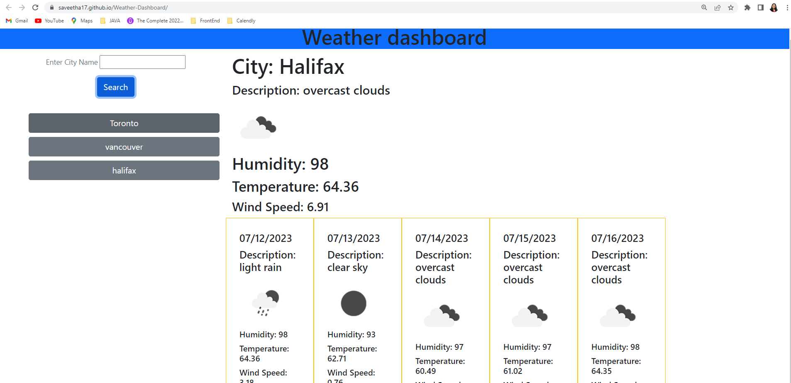

# Weather-Dashboard

## Description

Weather-Dashboard is a website application that enables the user to search for multiple cities and access current and future weather conditions. Upon searching for a city, the user is presented with information such as the city's name, date, weather condition icon, temperature, humidity, and wind speed. The dashboard also stores the user's search history, allowing them to revisit cities and review their current and future weather conditions at any time.

## Technologies Used

- HTML
- CSS
- Java Script
- Bootstrap

## Usage

## Link to Github Repository

https://github.com/saveetha17/Weather-Dashboard.git

## Link to Deployed Application

https://saveetha17.github.io/Weather-Dashboard/
